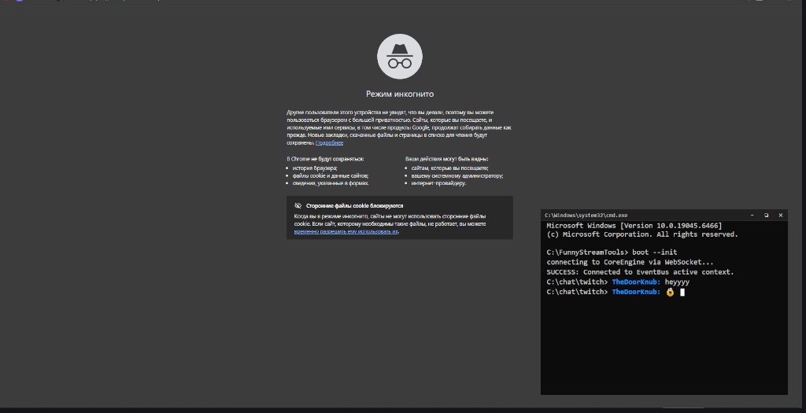
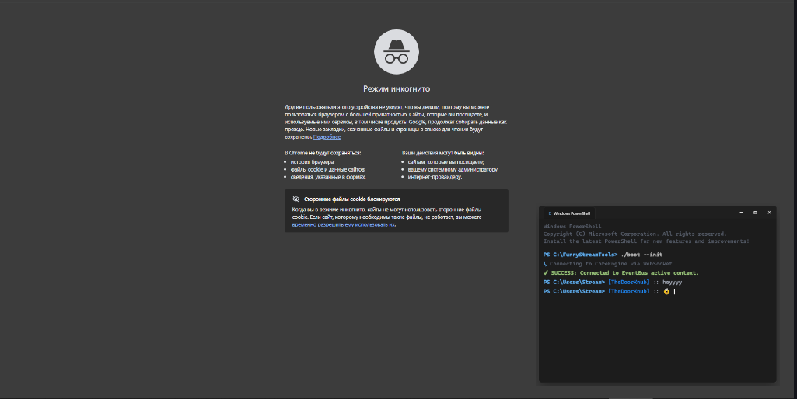
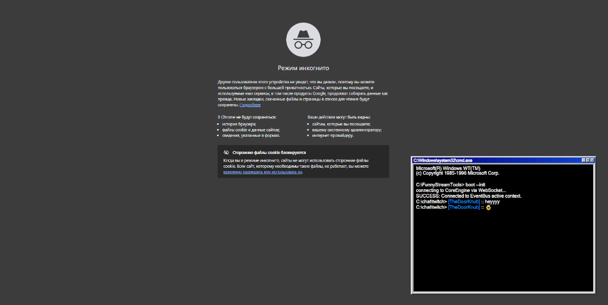

# FunnyStreamTools

**FunnyStreamTools** is a lightweight, modular, and highly customizable streaming utility designed to add an aesthetic edge to your live broadcasts. It bridges your streaming platforms (Twitch, Discord, etc.) directly into a beautiful, terminal-inspired overlay for OBS.

---

## 📸 Preview Gallery

<p align="center">
  
  
  
</p>

---

## 🚀 Features

* **Terminal Aesthetic**: Features a custom Windows-style CMD terminal overlay with real-time feedback, typewriter effects, and retro sounds.
* **Ultimate Emote Integration**: Full, built-in support for rendering custom and global emotes from **Twitch**, **7TV**, **BetterTTV (BTTV)**, and **FrankerFaceZ (FFZ)** inside the console chat overlay.
* **Discord Integration**: Real-time voice activity monitoring via local Discord RPC. No bot tokens required - it hooks directly into your local Discord client.
* **Modular Architecture**: Easily add new data providers (e.g., YouTube, Discord) and UI plugins without touching the core engine.
* **Event-Driven**: Built on an asynchronous event bus, ensuring high performance and low latency for your stream overlays.

## 🛠 Prerequisites

* **Python 3.10+**
* **Discord Desktop App** (Must be running for voice integration)
* **OBS Studio** (To add the browser source overlays)

## 📦 Installation

1. **Clone the repository**:
```bash
git clone https://github.com/777Chara777/FunnyStreamTools.git
cd FunnyStreamTools

```

2. **Install dependencies**:

```bash
uv sync

```

## 🚀 Running the App

Start the core engine from the root directory:

```bash
uv run main.py

```

The server will start at `http://127.0.0.1:8000`.

## 📺 Setting up in OBS

1. Open **OBS Studio**.
2. Add a new **Browser Source**.
3. Set the URL to the plugin endpoint:
   * **Chat Terminal**: `http://127.0.0.1:8000/widget/commandchat` - Retro terminal-style chat overlay.
   * **Blue Screen (BSOD)**: `http://127.0.0.1:8000/widget/bluescreen` - Windows Blue Screen of Death widget for channel point redeems or alerts.
   * **Canvas Widget**: `http://127.0.0.1:8000/widget/canvas/widget` - The final overlay screen that renders everything onto your OBS scene.
   * **Canvas Admin Dashboard**: `http://127.0.0.1:8000/widget/canvas/admin` - A Figma-like interactive workspace where you can dynamically place text, images, and layers in real-time.
   * **Dashboard Config**: `http://127.0.0.1:8000/widget/dashboard` - Core application configuration panel.

4. Set the desired width and height (e.g., `600x600` or custom terminal dimensions).
5. Check **"Refresh browser when scene becomes active"** if desired.

> 💡 **Tip:** Open the **Canvas Admin Dashboard** in your regular browser to arrange your alerts, graphics, and text layouts just like you would do in Figma, while keeping the **Canvas Widget** open as a source inside OBS to see the changes update in real-time.

## 🧩 Developing Plugins & SDK Generation

FunnyStreamTools supports a modular architecture for creating custom UI widgets and data providers. To get full IDE autocomplete, type hints, and documentation for the core API, you can generate a custom SDK directly from the application.

Generate the `.pyi` stub files by running:

```bash
uv run main.py --generate-sdk

```

This will create a `.my_app_sdk/` directory in your workspace.

### Setting up your IDE

* **VS Code**: Add `".my_app_sdk"` to your `python.analysis.extraPaths` settings.
* **PyCharm**: Right-click the `.my_app_sdk` folder -> *Mark Directory as* -> *Excluded* (or add it as an External Library) so the IDE indexes the stubs for auto-completion.

### 🔌 Managing Third-Party Dependencies for External Plugins
If your external plugins require specific third-party libraries (e.g., `requests`, `aiohttp`, etc.) that are not packaged inside the core binary, the app will automatically resolve them from a **local virtual environment (`.venv`)** placed right next to the executable.

Simply make sure that a `.venv` directory containing the required modules is present in the same folder as `main.exe` (as shown in the folder tree above). On startup, the core application will automatically inject `.venv/Lib/site-packages` into its execution path to load plugin dependencies seamlessly.

## 🧩 How it works

1. **Providers**: Listen to external APIs (Twitch/Discord) and push events to the `EventBus`.
2. **EventBus**: A central hub that dispatches messages to the appropriate plugins.
3. **Plugins**: WebSocket-based interfaces that render incoming events into web-based UI widgets with high-performance text and asset handling.

## 🛡 License

This project is open-source and free to use for your streaming needs.

---

*Happy Streaming!*
